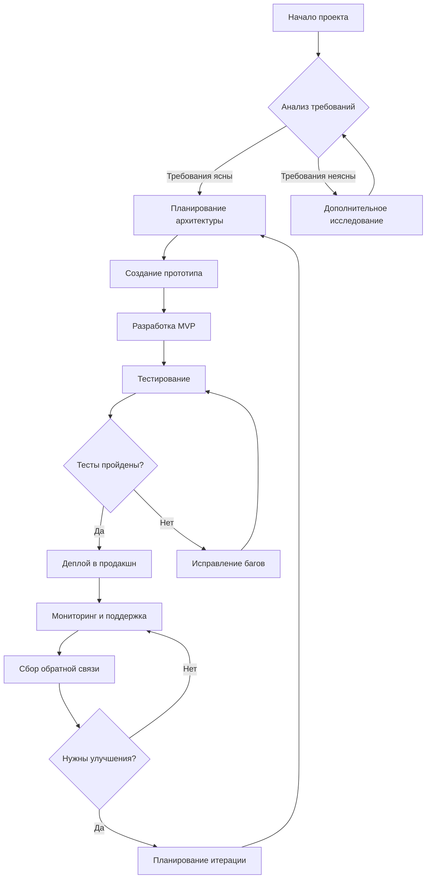
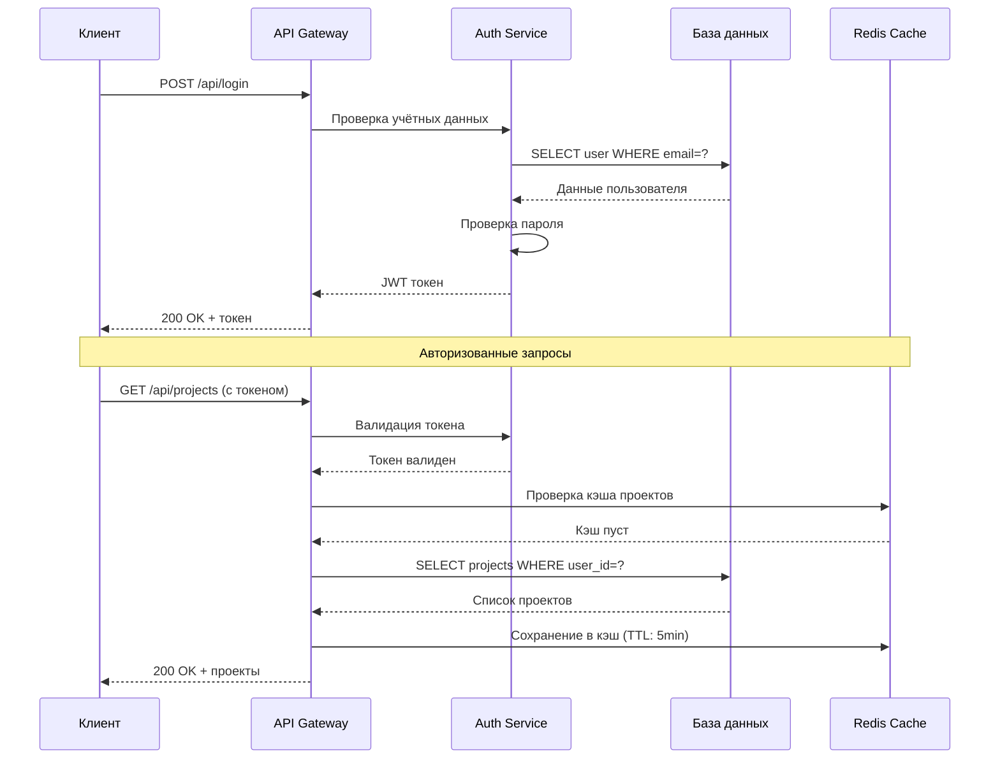
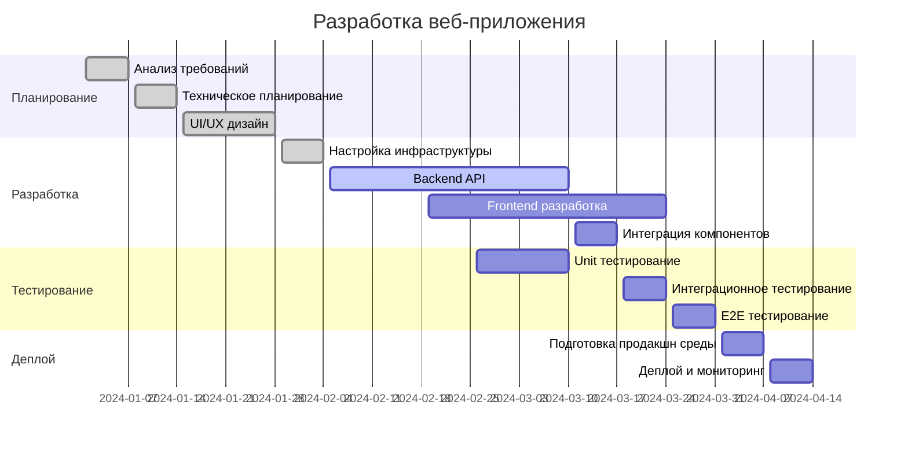
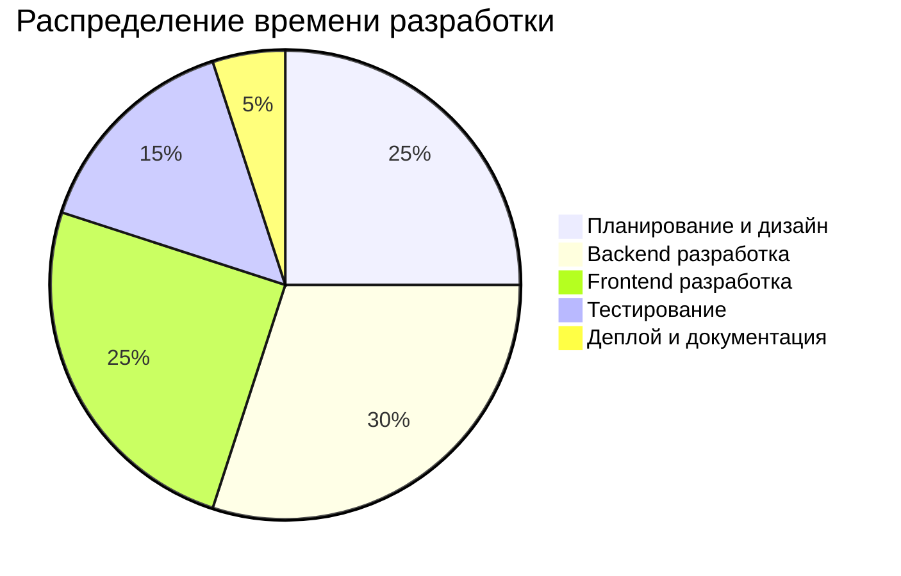

# Комплексный пример Markdown с markdown-it

Этот документ демонстрирует возможности библиотеки markdown-it и её популярных плагинов.

## Содержание

- [Блоки кода](#блоки-кода)
- [Диаграммы Mermaid](#диаграммы-mermaid)
- [Математические формулы](#математические-формулы)
- [Таблицы](#таблицы)
- [Списки задач](#списки-задач)
- [Сноски и ссылки](#сноски-и-ссылки)
- [Эмодзи и символы](#эмодзи-и-символы)
- [Контейнеры и предупреждения](#контейнеры-и-предупреждения)
- [Форматирование текста](#форматирование-текста)
- [Определения и аббревиатуры](#определения-и-аббревиатуры)
- [HTML элементы](#html-элементы)
- [Цитаты](#цитаты)

---

## Блоки кода

### JavaScript
```javascript
// Пример асинхронной функции
async function fetchUserData(userId) {
    try {
        const response = await fetch(`/api/users/${userId}`);
        const userData = await response.json();
        return userData;
    } catch (error) {
        console.error('Ошибка загрузки данных:', error);
        throw error;
    }
}

// Использование
fetchUserData(123).then(user => {
    console.log(`Привет, ${user.name}!`);
});
```

### Python
```python
# Класс для работы с данными
class DataProcessor:
    def __init__(self, data_source):
        self.data_source = data_source
        self.processed_data = []
    
    def process_data(self):
        """Обработка данных с фильтрацией и трансформацией"""
        for item in self.data_source:
            if self.validate_item(item):
                processed_item = self.transform_item(item)
                self.processed_data.append(processed_item)
        return self.processed_data
    
    def validate_item(self, item):
        return item is not None and len(str(item)) > 0
    
    def transform_item(self, item):
        return str(item).upper().strip()

# Использование
processor = DataProcessor(['hello', 'world', '', None, 'python'])
result = processor.process_data()
print(f"Обработано элементов: {len(result)}")
```

### HTML
```html
<!DOCTYPE html>
<html lang="ru">
<head>
    <meta charset="UTF-8">
    <meta name="viewport" content="width=device-width, initial-scale=1.0">
    <title>Пример страницы</title>
    <link rel="stylesheet" href="styles.css">
</head>
<body>
    <header class="main-header">
        <nav class="navigation">
            <ul class="nav-list">
                <li><a href="#home">Главная</a></li>
                <li><a href="#about">О нас</a></li>
                <li><a href="#contact">Контакты</a></li>
            </ul>
        </nav>
    </header>
    
    <main class="content">
        <section id="hero">
            <h1>Добро пожаловать!</h1>
            <p>Это пример HTML страницы с семантической разметкой.</p>
        </section>
    </main>
    
    <script src="script.js"></script>
</body>
</html>
```

### CSS
```css
/* Современные CSS стили с Grid и Flexbox */
:root {
    --primary-color: #3498db;
    --secondary-color: #2c3e50;
    --accent-color: #e74c3c;
    --text-color: #333;
    --background-color: #f8f9fa;
    --border-radius: 8px;
    --box-shadow: 0 2px 10px rgba(0, 0, 0, 0.1);
}

.container {
    display: grid;
    grid-template-columns: 1fr 3fr 1fr;
    grid-template-rows: auto 1fr auto;
    grid-template-areas: 
        "header header header"
        "sidebar main aside"
        "footer footer footer";
    min-height: 100vh;
    gap: 1rem;
    padding: 1rem;
}

.main-header {
    grid-area: header;
    background: linear-gradient(135deg, var(--primary-color), var(--secondary-color));
    color: white;
    padding: 1rem;
    border-radius: var(--border-radius);
    box-shadow: var(--box-shadow);
}

@media (max-width: 768px) {
    .container {
        grid-template-columns: 1fr;
        grid-template-areas: 
            "header"
            "main"
            "sidebar"
            "aside"
            "footer";
    }
}
```

### SQL
```sql
-- Создание базы данных для системы управления проектами
CREATE DATABASE project_management;
USE project_management;

-- Таблица пользователей
CREATE TABLE users (
    id INT PRIMARY KEY AUTO_INCREMENT,
    username VARCHAR(50) UNIQUE NOT NULL,
    email VARCHAR(100) UNIQUE NOT NULL,
    password_hash VARCHAR(255) NOT NULL,
    first_name VARCHAR(50),
    last_name VARCHAR(50),
    created_at TIMESTAMP DEFAULT CURRENT_TIMESTAMP,
    updated_at TIMESTAMP DEFAULT CURRENT_TIMESTAMP ON UPDATE CURRENT_TIMESTAMP,
    is_active BOOLEAN DEFAULT TRUE
);

-- Сложный запрос с JOIN и агрегацией
SELECT 
    u.username,
    u.first_name,
    u.last_name,
    COUNT(p.id) as total_projects,
    COUNT(CASE WHEN p.status = 'completed' THEN 1 END) as completed_projects,
    AVG(p.budget) as avg_budget,
    MAX(p.end_date) as latest_project_end
FROM users u
LEFT JOIN projects p ON u.id = p.owner_id
WHERE u.is_active = TRUE
GROUP BY u.id, u.username, u.first_name, u.last_name
HAVING COUNT(p.id) > 0
ORDER BY completed_projects DESC, total_projects DESC
LIMIT 10;
```

### JSON
```json
{
  "api": {
    "version": "2.1.0",
    "name": "Project Management API",
    "description": "RESTful API для управления проектами и задачами",
    "baseUrl": "https://api.projectmanager.com/v2",
    "authentication": {
      "type": "Bearer",
      "tokenEndpoint": "/auth/token",
      "refreshEndpoint": "/auth/refresh"
    }
  },
  "endpoints": {
    "users": {
      "list": {
        "method": "GET",
        "path": "/users",
        "parameters": {
          "page": {
            "type": "integer",
            "default": 1,
            "description": "Номер страницы"
          },
          "limit": {
            "type": "integer",
            "default": 20,
            "max": 100,
            "description": "Количество элементов на странице"
          }
        }
      }
    }
  },
  "errorCodes": {
    "400": "Неверный запрос",
    "401": "Не авторизован",
    "403": "Доступ запрещён",
    "404": "Ресурс не найден",
    "500": "Внутренняя ошибка сервера"
  }
}
```

---

## Диаграммы Mermaid

### Flowchart - Процесс разработки


### Sequence Diagram - API взаимодействие


### Gantt Chart - План проекта


### Pie Chart - Распределение времени


---

## Математические формулы

### Inline формулы
Квадратное уравнение имеет вид $ax^2 + bx + c = 0$, где дискриминант $D = b^2 - 4ac$.

Формула Эйлера: $e^{i\pi} + 1 = 0$ - одна из самых красивых формул в математике.

Производная функции $f(x) = x^n$ равна $f'(x) = nx^{n-1}$.

### Block формулы

Формула для решения квадратного уравнения:
$$x = \frac{-b \pm \sqrt{b^2 - 4ac}}{2a}$$

Интеграл Гаусса:
$$\int_{-\infty}^{\infty} e^{-x^2} dx = \sqrt{\pi}$$

Ряд Тейлора для экспоненциальной функции:
$$e^x = \sum_{n=0}^{\infty} \frac{x^n}{n!} = 1 + x + \frac{x^2}{2!} + \frac{x^3}{3!} + \cdots$$

Формула Байеса:
$$P(A|B) = \frac{P(B|A) \cdot P(A)}{P(B)}$$

Матричное умножение:
$$\begin{pmatrix}
a & b \\
c & d
\end{pmatrix}
\begin{pmatrix}
e & f \\
g & h
\end{pmatrix}
=
\begin{pmatrix}
ae + bg & af + bh \\
ce + dg & cf + dh
\end{pmatrix}$$

---

## Таблицы

### Простая таблица с выравниванием
| Язык программирования | Год создания | Парадигма | Популярность |
|:---------------------|:------------:|:----------|-------------:|
| JavaScript           | 1995         | Мультипарадигменный | ⭐⭐⭐⭐⭐ |
| Python               | 1991         | Объектно-ориентированный | ⭐⭐⭐⭐⭐ |
| Java                 | 1995         | Объектно-ориентированный | ⭐⭐⭐⭐ |
| C++                  | 1985         | Мультипарадигменный | ⭐⭐⭐ |
| Rust                 | 2010         | Системный | ⭐⭐⭐ |

### Сравнительная таблица фреймворков
| Фреймворк | Язык | Тип | Размер сообщества | Кривая обучения | Производительность |
|-----------|------|-----|:-----------------:|:---------------:|:------------------:|
| React     | JavaScript | Библиотека | Очень большое | Средняя | Высокая |
| Vue.js    | JavaScript | Фреймворк | Большое | Низкая | Высокая |
| Angular   | TypeScript | Фреймворк | Большое | Высокая | Высокая |
| Svelte    | JavaScript | Компилятор | Среднее | Низкая | Очень высокая |
| Django    | Python | Фреймворк | Большое | Средняя | Средняя |
| FastAPI   | Python | Фреймворк | Растущее | Низкая | Высокая |

---

## Списки задач

### Разработка проекта
- [x] Анализ требований и планирование
- [x] Создание технического задания
- [x] Выбор технологического стека
- [ ] Настройка среды разработки
  - [x] Установка Node.js и npm
  - [x] Настройка ESLint и Prettier
  - [ ] Конфигурация TypeScript
  - [ ] Настройка тестовой среды
- [ ] Разработка backend API
  - [ ] Создание моделей данных
  - [ ] Реализация аутентификации
  - [ ] CRUD операции для пользователей
  - [ ] CRUD операции для проектов
- [ ] Разработка frontend
  - [ ] Создание компонентов UI
  - [ ] Интеграция с API
  - [ ] Реализация роутинга
  - [ ] Добавление тестов

### Личные задачи
- [x] Изучить документацию markdown-it
- [x] Настроить рабочее окружение
- [ ] Написать примеры кода
- [ ] Протестировать все плагины
- [ ] Создать демонстрационную страницу

---

## Сноски и ссылки

Markdown-it[^1] является одной из самых популярных библиотек для парсинга Markdown. Она поддерживает CommonMark[^2] спецификацию и множество расширений.

Для работы с математическими формулами используется плагин markdown-it-katex[^3], который интегрирует KaTeX[^4] для рендеринга LaTeX формул.

### Внешние ссылки
- [Официальная документация markdown-it](https://markdown-it.github.io/)
- [GitHub репозиторий](https://github.com/markdown-it/markdown-it)
- [NPM пакет](https://www.npmjs.com/package/markdown-it)
- [Демо страница](https://markdown-it.github.io/markdown-it/)

### Внутренние ссылки
Перейти к разделу [Блоки кода](#блоки-кода) или к [Диаграммам Mermaid](#диаграммы-mermaid).

[^1]: markdown-it - быстрый и расширяемый парсер Markdown для JavaScript
[^2]: CommonMark - строго определённая спецификация Markdown
[^3]: markdown-it-katex - плагин для рендеринга математических формул
[^4]: KaTeX - быстрая библиотека для рендеринга математических формул

---

## Эмодзи и символы

### Эмодзи в тексте
Разработка программного обеспечения - это увлекательный процесс! 🚀

Основные этапы:
- Планирование 📋
- Кодирование 💻
- Тестирование 🧪
- Деплой 🌐
- Поддержка 🔧

### Технические символы
- ✅ Задача выполнена
- ❌ Ошибка
- ⚠️ Предупреждение
- ℹ️ Информация
- 🔥 Критическая проблема
- 💡 Идея
- 📊 Аналитика
- 🎯 Цель
- 🔒 Безопасность
- ⚡ Производительность

### Статусы проектов
| Проект | Статус | Прогресс |
|--------|--------|----------|
| API Gateway | 🟢 Готов | 100% |
| Frontend App | 🟡 В разработке | 75% |
| Mobile App | 🔴 Заблокирован | 25% |
| Documentation | 🟠 Ожидает | 0% |

---

## Контейнеры и предупреждения

::: info Информация
Это информационное сообщение с полезными сведениями для разработчиков.
:::

::: tip Совет
Используйте TypeScript для лучшей типизации и предотвращения ошибок во время разработки.
:::

::: warning Предупреждение
Не забудьте обновить зависимости перед деплоем в продакшн!
:::

::: danger Опасность
Никогда не коммитьте секретные ключи и пароли в публичный репозиторий!
:::

::: details Подробности
Этот блок содержит дополнительную информацию, которая скрыта по умолчанию и раскрывается по клику.

```javascript
// Пример конфигурации
const config = {
    apiUrl: process.env.API_URL,
    secretKey: process.env.SECRET_KEY,
    debug: process.env.NODE_ENV === 'development'
};
```
:::

### Кастомные контейнеры

::: note Заметка
Важная информация для запоминания.
:::

::: success Успех
Операция выполнена успешно!
:::

::: error Ошибка
Произошла критическая ошибка в системе.
:::

---

## Форматирование текста

### Базовое форматирование
Это **жирный текст** и *курсивный текст*. Можно комбинировать ***жирный курсив***.

### Специальное форматирование
- ==Выделенный текст== (подсветка)
- ~~Зачёркнутый текст~~
- `Inline код`
- Подстрочный текст: H~2~O
- Надстрочный текст: E=mc^2^

### Клавиши и команды
Нажмите ++ctrl+c++ для копирования и ++ctrl+v++ для вставки.

Для сохранения файла используйте ++ctrl+s++.

### Специальные символы
- → Стрелка вправо
- ← Стрелка влево
- ↑ Стрелка вверх
- ↓ Стрелка вниз
- © Копирайт
- ® Зарегистрированная торговая марка
- ™ Торговая марка
- § Параграф
- ¶ Знак абзаца

---

## Определения и аббревиатуры

### Определения терминов

API
:   Application Programming Interface - набор определений и протоколов для создания и интеграции программного обеспечения приложений.

REST
:   Representational State Transfer - архитектурный стиль для распределённых гипермедиа систем.

JSON
:   JavaScript Object Notation - текстовый формат обмена данными, основанный на JavaScript.

### Аббревиатуры

Первое упоминание HTML (HyperText Markup Language) в тексте будет расшифровано.

Аналогично с CSS (Cascading Style Sheets) и JS (JavaScript).

*[HTML]: HyperText Markup Language
*[CSS]: Cascading Style Sheets
*[JS]: JavaScript
*[API]: Application Programming Interface
*[REST]: Representational State Transfer
*[JSON]: JavaScript Object Notation
*[HTTP]: HyperText Transfer Protocol
*[HTTPS]: HyperText Transfer Protocol Secure
*[URL]: Uniform Resource Locator
*[URI]: Uniform Resource Identifier

---

## HTML элементы

### Встроенные HTML теги

<div class="custom-container">
    <h4>Кастомный контейнер</h4>
    <p>Этот блок создан с помощью HTML тегов внутри Markdown.</p>
    <ul>
        <li>Элемент списка 1</li>
        <li>Элемент списка 2</li>
    </ul>
</div>

### Формы и интерактивные элементы

<form>
    <fieldset>
        <legend>Обратная связь</legend>
        <label for="name">Имя:</label>
        <input type="text" id="name" name="name" placeholder="Введите ваше имя">
        
        <label for="email">Email:</label>
        <input type="email" id="email" name="email" placeholder="your@email.com">
        
        <label for="message">Сообщение:</label>
        <textarea id="message" name="message" rows="4" placeholder="Ваше сообщение..."></textarea>
        
        <button type="submit">Отправить</button>
    </fieldset>
</form>

### Медиа элементы

<figure>
    
    <figcaption>Подпись к изображению</figcaption>
</figure>

<details>
    <summary>Раскрывающийся блок</summary>
    <p>Содержимое, которое скрыто по умолчанию и показывается при клике на заголовок.</p>
    <pre><code>console.log('Скрытый код');</code></pre>
</details>

---

## Цитаты

### Простые цитаты

> Код - это поэзия в движении.
> 
> Каждая строка должна иметь смысл и красоту.

### Вложенные цитаты

> Программирование - это искусство.
> 
> > Хороший код читается как хорошая проза.
> > 
> > > Простота - это высшая форма изощрённости.

### Цитаты с атрибуцией

> Любой дурак может написать код, который поймёт компьютер. Хорошие программисты пишут код, который могут понять люди.
> 
> — <cite>Мартин Фаулер</cite>

> Сначала решите проблему. Затем напишите код.
> 
> — <cite>Джон Джонсон</cite>

### Блок-цитата с кодом

> Пример хорошего кода:
> 
> ```javascript
> function greet(name) {
>     return `Привет, ${name}!`;
> }
> ```
> 
> Этот код ясен, краток и выразителен.

---

## Дополнительные элементы

### Горизонтальные разделители

Разделитель выше создан с помощью `---`.

***

Этот разделитель создан с помощью `***`.

___

А этот - с помощью `___`.

### Escape-последовательности

Чтобы показать \*звёздочки\* без форматирования, используйте обратный слеш.

Аналогично с \`обратными кавычками\` и \[квадратными скобками\].

### Комментарии

<!-- Это HTML комментарий, который не будет отображаться -->

### Якорные ссылки {#custom-anchor}

Этот заголовок имеет кастомный якорь, на который можно ссылаться: [ссылка на якорь](#custom-anchor).

---

## Заключение

Этот документ демонстрирует богатые возможности markdown-it и его плагинов для создания комплексной технической документации. Все представленные элементы могут быть использованы для создания профессиональных документов, README файлов, технических спецификаций и обучающих материалов.

### Полезные ресурсы

1. **Документация**: [markdown-it.github.io](https://markdown-it.github.io/)
2. **Плагины**: [npm search markdown-it](https://www.npmjs.com/search?q=markdown-it)
3. **Примеры**: [GitHub репозиторий](https://github.com/markdown-it/markdown-it)

---

*Документ создан с использованием markdown-it и демонстрирует возможности современного Markdown.*